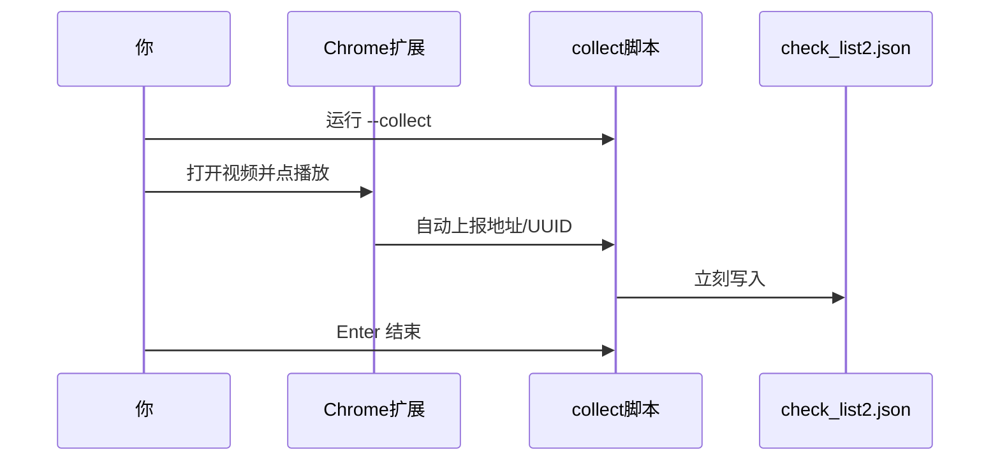
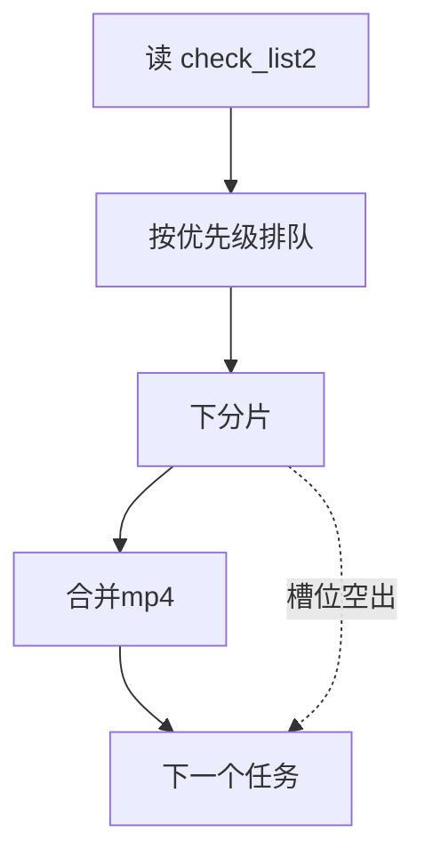

# MissAV 视频采集下载

## 解决了missav不能使用各种工具下载的问题
- 仓鼠症朋友们又有救了
- 不能下载原因，经鉴定之后是因为nurrit的反爬问题，本工具通过获取浏览器中uuID的形式解决了此问题
- 这个是一个单机使用的小工具：Chrome 里点播放，扩展自动把地址记下来；有空再批量下成 mp4
- **只能跑在你自己的 Windows 电脑上，尝试兼容群晖nas，结果兼容失败，争取下一版再做一个试试**
- **开missav需要梯子，但是下载部分不需要梯子**

---

## 使用指南

0. 前置：安装依赖 + ffmpeg（合并 mp4 用，需在 PATH 里能直接跑 `ffmpeg`）
1. Chrome 扩展：`chrome://extensions` → 开开发者模式 → 「加载已解压的扩展程序」→ 选本仓库 `chrome_extension` 文件夹
2. `python download_missav.py --collect`
3. `python download_missav.py --download-only`
- 可以添加参数 `python download_missav.py --download-only --parallel 4 --workers 20`，默认参数比较保守（见下文），但是这个4*12参数可以显著提升下载速度（但是可能会被反爬）。剩下的参数什么的问你的AI

---

## 我最后决定让AI写一个详细介绍
**但是我依然建议你直接问你的AI比较好**

## 第一步：采集

```powershell
pip install -r requirements.txt
python download_missav.py --collect
```

1. Chrome 打开 MissAV 视频页，**点一下播放**
2. 扩展抓到 m3u8 后，自动写进 `check_list2.json`
3. 采够了，回终端按 **Enter** 结束



---

## 第二步：下载

```powershell
python download_missav.py --download-only
```

- 默认最多同时下 2 个视频，每个视频 4 个分片线程
- 默认保存到 `D:\downloads`（可在项目根 `.env` 设 `DOWNLOAD_DIR=...`，或用 `--output` 改）
- 下完一个会马上合并 mp4，**需要 ffmpeg**；合并时下载槽可以接下一个
- 默认开进度页，终端会打印地址，自己点开即可（一般是 `http://127.0.0.1:8777`）
- 不想要网页：加 `--no-web`



### 任务状态（中断了也不怕）


下次再跑时的优先顺序：

1. `download_done` → **只合并**，不再下分片  
2. `downloading` → **接着下**  
3. `ready` → 新任务  

---

## 常用参数

| 参数 | 干啥用 |
|------|--------|
| `--workers 8` | 每个视频分片线程数（默认 4） |
| `--parallel 2` | 同时下载几个视频（默认 2） |
| `--max-segments 5` | 只下前几片，测通流程用 |
| `--no-web` | 关掉进度页 |
| `--web-port 8777` | 改进度页端口 |
| `--output D:\某目录` | 换保存目录（默认 `D:\downloads` 或 `.env`） |
| `--check-list 路径` | 换 checklist JSON（默认 `check_list2.json`） |
| `--keep-segments` | 合并后保留分片目录（默认删） |
| `--url URL --uuid UUID` | 单条下载，跳过采集清单 |
| `--title 标题` | 配合 `--url --uuid` 指定文件名 |

---

## 文件大概长什么样

| 东西 | 说明 |
|------|------|
| `chrome_extension/` | Chrome 扩展|
| `check_list2.json` | 采集结果|
| `.env` | 本机配置，如 `DOWNLOAD_DIR=D:\某目录`|
| `missav.ws_cookies.txt` | Cookie |

---

## 一句话上手

```powershell
pip install -r requirements.txt
# 确保 ffmpeg 在 PATH；Chrome 加载 chrome_extension
python download_missav.py --collect          # 点播放采集
python download_missav.py --download-only    # 有空再下
```

更细的终端说明写在 `download_missav.py` 文件最上面。

---

## 免责声明

本工具仅供个人学习与技术研究。请遵守所在地法律法规及目标网站服务条款，勿用于任何侵权或商业用途。下载什么、存哪里、怎么用，你自己决定并自行承担后果。
